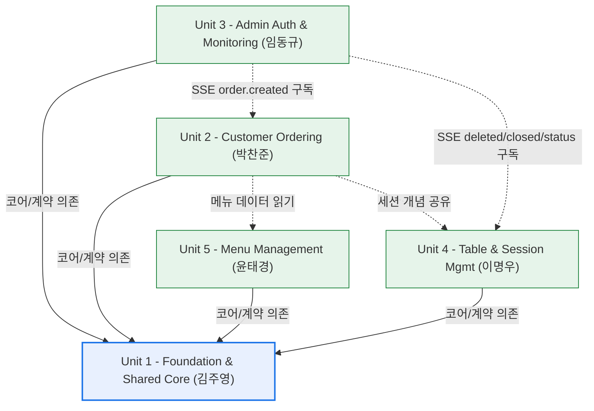
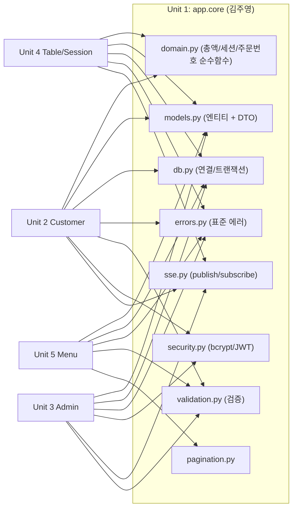
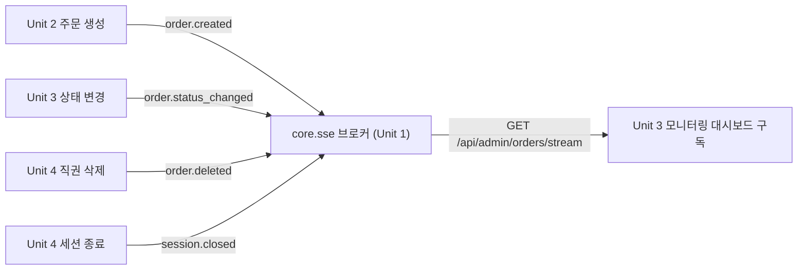
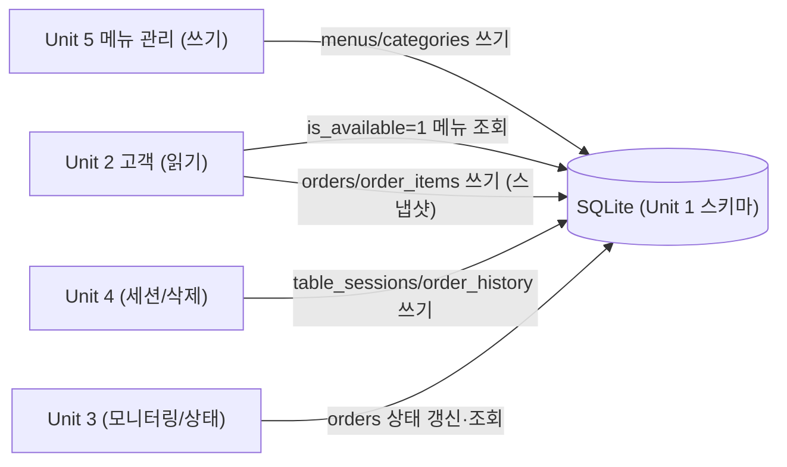
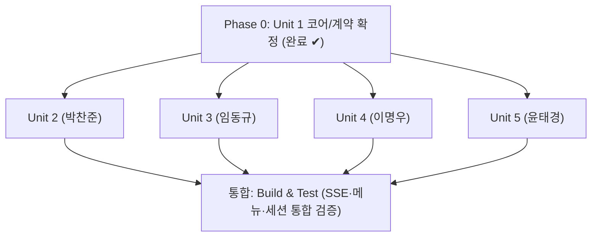

# Unit Dependency Graph — 구현 기준 (테이블오더 서비스)

> **작성/소유**: Unit 1 (김주영) · **기준 시점**: Unit 1 코어/계약 확정 후 (commit 340bf5e)
> **목적**: 5개 유닛이 병렬 개발할 때의 실제 코드 의존성을 코어 모듈·SSE 이벤트·API·데이터 흐름 수준으로 시각화. Inception 시점 상위 버전은 `inception/application-design/unit-of-work-dependency.md` 참조.

---

## 1. 유닛 레벨 의존성 (개요)

- **실선(→)**: 빌드/코드 의존(코어 모듈·계약 인터페이스). 컴파일·import 수준.
- **점선(-.->)**: 런타임 의존(SSE 이벤트·데이터 조회). 인터페이스는 Unit 1 계약으로 이미 고정되어 병렬 개발을 막지 않음.

---

## 2. 코어 모듈 의존성 (어느 유닛이 무엇을 쓰는가)

Unit 1의 `backend/app/core/*`를 각 유닛이 어떻게 소비하는지.

### 코어 모듈 사용 매트릭스
| core 모듈 | U2 고객 | U3 관리자 | U4 테이블/세션 | U5 메뉴 |
|---|:---:|:---:|:---:|:---:|
| `domain` (순수함수) | ✔ 총액·세션·주문번호 | — | ✔ 총액 재계산 | — |
| `models` (엔티티/DTO) | ✔ | ✔ OrderSummary/Detail | ✔ | ✔ Menu/Category |
| `db` (연결/트랜잭션) | ✔ | ✔ | ✔ | ✔ |
| `errors` (표준 에러) | ✔ | ✔ | ✔ | ✔ |
| `validation` | ✔ 주문항목 | ✔ 상태값 | — | ✔ 메뉴 |
| `pagination` | ✔ 주문내역 | — | ✔ 이력 | ✔ 목록 |
| `security` (bcrypt/JWT) | ✔ 테이블 토큰 | ✔ 관리자 JWT | ✔ 테이블 비번 | — |
| `sse` (publish/subscribe) | ✔ publish | ✔ subscribe | ✔ publish | — |

---

## 3. SSE 이벤트 흐름 (런타임 pub/sub)

발행은 각 유닛이 `core.sse.publish(event, payload)`로, 구독은 Unit 3이 `core.sse.subscribe()`로.

| 이벤트 | 발행 유닛 | 구독 유닛 | 페이로드 |
|---|---|---|---|
| `order.created` | Unit 2 | Unit 3 | OrderSummary |
| `order.status_changed` | Unit 3 | Unit 3 | `{order_id, table_id, status}` |
| `order.deleted` | Unit 4 | Unit 3 | `{order_id, table_id, table_total}` |
| `session.closed` | Unit 4 | Unit 3 | `{table_id, session_id}` |

> Unit 3은 상태 변경을 자신이 발행하고 자신도 구독한다(대시보드 실시간 갱신). 브로커가 중개하므로 U3↔U3 직접 결합 아님.

---

## 4. 데이터 소유·소비 흐름

- 메뉴 데이터: **U5 쓰기 → U2 읽기** (계약 §3.4 / §3.1.2). 스냅샷 원칙(BR-7)으로 U5의 변경/삭제가 기존 주문에 영향 없음.
- 세션: **U4 라이프사이클 관리**, U2는 "현재 세션 주문만" 필터에 `domain.is_current_session_order` 사용.
- 주문: **U2 생성 → U3 상태변경 → U4 삭제/이력이동**. 총액은 `domain.calc_*`로 계산.

---

## 5. 개발 순서 (Phase)

- **Phase 0 (완료)**: Unit 1 — 코어 모듈·계약·스키마·SSE 브로커·순수함수 확정 및 푸시.
- **Phase 1 (병렬)**: Unit 2~5 동시 개발. 인터페이스가 Unit 1 계약으로 고정되어 상호 대기 없음.
- **통합**: 5개 유닛 완료 후 Build & Test 단계에서 SSE 이벤트/메뉴 데이터/세션 필터 통합 검증.

---

## 6. 순환 의존성 점검
- **순환 없음.** U1은 어떤 유닛에도 의존하지 않는 최하위 기반.
- U2↔U4(세션), U2↔U5(메뉴), U3↔U2/U4(SSE) 모두 **Unit 1 계약/브로커를 통한 간접 결합**이라 직접 순환이 아님.
- Phase 1의 4개 유닛은 서로 코드 의존(import)이 없어 완전 병렬 가능.

## 7. 병렬 개발 시 주의(공유 지점)
| 공유 자원 | 소유 | 병렬 충돌 방지 |
|---|---|---|
| `app.core.*`, 스키마, 계약 | Unit 1(김주영) | 변경은 Unit 1 조율(계약 §6). 다른 유닛은 읽기 전용 소비 |
| `frontend/admin/` (U3/U4/U5 공용) | 공용 Vue 앱 | 유닛별 별도 라우트/모듈로 분리 |
| `app.main.py` 라우터 등록 | Unit 1 부트스트랩 | 각 유닛이 `include_router` 한 줄씩 추가(주석 위치) — 병합 충돌 최소 |
